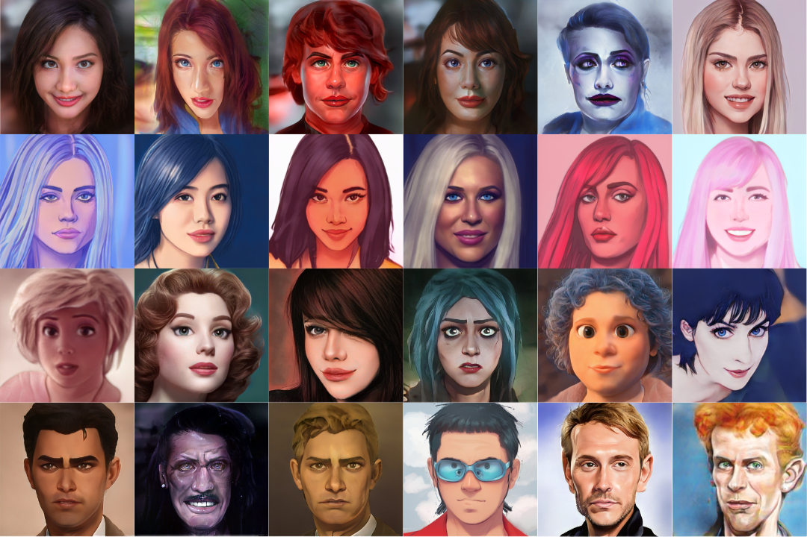

# Awesome-Portraits-Style-Transfer  

> An archive of studies related to portrait style transfer

## Table of Contents
+ [Papers](#Papers)
+ [Repositories](#Repositories)
+ [Datasets](#Datasets)

## Papers

### Based on GANs

| Date    | Title                                                                                                               | Publish             | Paper                                                                                      | Code                                                | Homepage                                             | Recom  |
|---------|---------------------------------------------------------------------------------------------------------------------|---------------------|--------------------------------------------------------------------------------------------|-----------------------------------------------------|-----------------------------------------------------|--------|
| 2024.11 | BeautyBank: Encoding Facial Makeup in Latent Space                                                                  | WACV 2025           | [[paper]](https://arxiv.org/abs/2411.11231)                                                | [[code]](https://github.com/CyberAgentAILab/BeautyBank) | N/A                                                   | ⭐️⭐️   |
| 2024.09 | PS-StyleGAN: Illustrative Portrait Sketching using Attention-Based Style Adaptation                                 | ArXiv 2024          | [[paper]](https://arxiv.org/abs/2409.00345)                                                | N/A                                                   | N/A                                                   | ⭐️⭐️   |
| 2024.08 | Multi-Style Facial Sketch Synthesis through Masked Generative Modeling                                              | ArXiv 2024          | [[paper]](https://arxiv.org/abs/2408.12400)                                                | N/A                                                   | N/A                                                   | ⭐️⭐️   |
| 2024.04 | ArtNeRF: A Stylized Neural Field for 3D-Aware Cartoonized Face Synthesis                                            | ICPR 2024           | [[paper]](https://arxiv.org/abs/2404.13711)                                                | [[code]](https://github.com/silence-tang/ArtNeRF)     | N/A                                                   | ⭐️⭐️   |
| 2024.03 | AgileGAN3D: Few-Shot 3D Portrait Stylization by Augmented Transfer Learning                                         | CVPRW 2024          | [[paper]](https://arxiv.org/abs/2303.14297)                                                | N/A                                                   | N/A                                                   | ⭐️⭐️   |
| 2024.03 | DoesFS: Deformable One-shot Face Stylization via DINO Semantic Guidance                                             | CVPR 2024           | [[paper]](https://arxiv.org/abs/2403.00459)                                                | [[code]](https://github.com/zichongc/DoesFS)         | [[homepage]](https://vcc.tech/research/2024/DoesFS) | ⭐️⭐️⭐️   |
| 2023.11 | 3D Face Style Transfer with a Hybrid Solution of NeRF and Mesh Rasterization                                        | WACV 2024           | [[paper]](https://arxiv.org/abs/2311.13168)                                                | N/A                                                   | N/A                                                   | ⭐️⭐️   |
| 2023.05 | MMFS: Multi-Modal Face Stylization with a Generative Prior                                                          | PG 2023             | [[paper]](https://arxiv.org/abs/2305.18009)                                                | [[code]](https://github.com/mmfs-paper/MMFS)         | N/A                                                   | ⭐️⭐️   |
| 2023.03 | Fix the Noise: Disentangling Source Feature for Controllable Domain Translation                                     | CVPR 2023           | [[paper]](https://arxiv.org/abs/2303.11545)                                                | [[code]](https://github.com/LeeDongYeun/FixNoise)    | N/A                                                   | ⭐️⭐️   |
| 2023.03 | StyleGANEX: StyleGAN-Based Manipulation Beyond Cropped Aligned Faces                                                | ICCV 2023           | [[paper]](https://openaccess.thecvf.com/content/ICCV2023/papers/Yang_StyleGANEX_StyleGAN-Based_Manipulation_Beyond_Cropped_Aligned_Faces_ICCV_2023_paper.pdf) | [[code]](https://github.com/williamyang1991/StyleGANEX) | [[homepage]](https://www.mmlab-ntu.com/project/styleganex/) | ⭐️⭐️   |
| 2022.11 | DynaGAN: Dynamic Few-shot Adaptation of GANs to Multiple Domains                                                    | SIGGRAPH Asia 2022  | [[paper]](https://arxiv.org/abs/2211.14554)                                                | [[code]](https://github.com/blueGorae/DynaGAN)       | [[homepage]](https://bluegorae.github.io/dynagan/)   | ⭐️⭐️   |
| 2022.10 | TargetCLIP: Official PyTorch implementation of the paper Image-Based CLIP-Guided Essence Transfer                   | ECCV 2022           | [[paper]](https://arxiv.org/abs/2110.12427)                                                | [[code]](https://github.com/hila-chefer/TargetCLIP)  | [[homepage]](https://github.com/hila-chefer/TargetCLIP) | ⭐️⭐️   |
| 2022.09 | VToonify: Controllable High-Resolution Portrait Video Style Transfer                                                | SIGGRAPH Asia 2022  | [[paper]](https://arxiv.org/abs/2209.11224)                                                | [[code]](https://github.com/williamyang1991/VToonify) | [[homepage]](https://www.mmlab-ntu.com/project/vtoonify/) | ⭐️⭐️⭐️   |
| 2022.09 | GODA: Generalized One-shot Domain Adaptation of Generative Adversarial Networks                                     | NeurIPS 2022        | [[paper]](https://arxiv.org/abs/2209.03665)                                                | [[code]](https://github.com/zhangzc21/Generalized-One-shot-GAN-adaptation) | N/A                                             | ⭐️⭐️   |
| 2022.07 | DCT-Net: Domain-Calibrated Translation for Portrait Stylization                                                     | SIGGRAPH 2022 (TOG) | [[paper]](https://arxiv.org/abs/2207.02426)                                                | [[code]](https://github.com/menyifang/DCT-Net)       | [[homepage]](https://menyifang.github.io/projects/DCTNet/DCTNet.html) | ⭐️⭐️   |
| 2022.06 | Real-Time Portrait Stylization on the Edge                                                                          | ArXiv 2022          | [[paper]](https://arxiv.org/abs/2206.01244)                                                | N/A                                                   | N/A                                                   | ⭐️⭐️   |
| 2022.04 | Unsupervised Image-to-Image Translation with Generative Prior                                                       | CVPR 2022           | [[paper]](https://arxiv.org/abs/2204.03641)                                                | [[code]](https://github.com/williamyang1991/GP-UNIT) | [[homepage]](https://www.mmlab-ntu.com/project/gpunit/) | ⭐️⭐️   |
| 2022.03 | CtlGAN: Few-shot Artistic Portraits Generation with Contrastive Transfer Learning                                   | ArXiv 2022          | [[paper]](https://arxiv.org/abs/2203.08612)                                                | N/A                                                   | N/A                                                   | ⭐️⭐️   |
| 2022.03 | A Style-aware Discriminator for Controllable Image Translation                                                      | CVPR 2022            | [[paper]](hhttps://arxiv.org/abs/2203.15375)                                    | [[code]](https://github.com/kunheek/style-aware-discriminator) | [[homepage]](https://github.com/kunheek/style-aware-discriminator) | ⭐️⭐️   |
| 2022.03 | Pastiche Master: Exemplar-Based High-Resolution Portrait Style Transfer                                             | CVPR 2022           | [[paper]](https://arxiv.org/abs/2203.13248.pdf)                                            | [[code]](https://github.com/williamyang1991/DualStyleGAN)                                                   | N/A | ⭐️⭐️⭐️   |
| 2022.03 | OneShotCLIP: One-Shot Adaptation of GAN in Just One CLIP                                                            | TPAMI 2023          | [[paper]](https://arxiv.org/abs/2203.09301)                                                | [[code]](https://github.com/cyclomon/OneshotCLIP)      | N/A                                                   | ⭐️⭐️   |
| 2021.12 | SemanticStyleGAN: Learning Compositional Generative Priors for Controllable Image Synthesis and Editing             | CVPR 2022           | [[paper]](https://arxiv.org/abs/2112.02236)                                                | [[code]](https://github.com/seasonSH/SemanticStyleGAN) | [[homepage]](https://semanticstylegan.github.io/)    | ⭐️⭐️   |
| 2021.12 | BlendGAN: Implicitly GAN Blending for Arbitrary Stylized Face Generation                                            | NeurIPS 2021        | [[paper]](https://arxiv.org/abs/2110.11728)                                                | [[code]](https://github.com/onion-liu/BlendGAN)       | [[homepage]](https://github.com/onion-liu/BlendGAN)  | ⭐️⭐️⭐️     |
| 2021.11 | MTG: Mind the Gap: Domain Gap Control for Single Shot Domain Adaptation for Generative Adversarial Networks         | ICLR 2022           | [[paper]](https://arxiv.org/abs/2110.08398)                                                | [[code]](https://github.com/ZPdesu/MindTheGap)       | [[homepage]](https://zpdesu.github.io/MindTheGap/)   | ⭐️⭐️⭐️   |
| 2021.09 | CariMe: Unpaired Caricature Generation with Multiple Exaggerations                                                  | TMM 2021            | [[paper]](https://ieeexplore.ieee.org/abstract/document/9454341)                           | [[code]](https://github.com/edward3862/CariMe-pytorch) | [[homepage]](https://github.com/edward3862/CariMe-pytorch) | ⭐️⭐️     |
| 2021.09 | StyleCariGAN: Caricature Generation via StyleGAN Feature Map Modulation                                             | SIGGRAPH 2021       | [[paper]](https://wonjongg.me/StyleCariGAN/)                                               | [[code]](https://github.com/wonjongg/StyleCariGAN)    | [[homepage]](https://github.com/wonjongg/StyleCariGAN) | ⭐️⭐️     |
| 2021.09 | ReStyle: A Residual-Based StyleGAN Encoder via Iterative Refinement                                                 | ICCV 2021           | [[paper]](https://yuval-alaluf.github.io/restyle-encoder/)                                 | [[code]](https://github.com/yuval-alaluf/restyle-encoder?tab=readme-ov-file) | [[homepage]](https://github.com/yuval-alaluf/restyle-encoder?tab=readme-ov-file) | ⭐️⭐️   |
| 2021.09 | SPatchGAN: A Statistical Feature Based Discriminator for Unsupervised Image-to-Image Translation                    | ICCV 2021           | [[paper]](https://arxiv.org/abs/2103.16219)                                                | [[code]](https://github.com/NetEase-GameAI/SPatchGAN) | [[homepage]](https://github.com/NetEase-GameAI/SPatchGAN) | ⭐️     |
| 2021.07 | AgileGAN: Stylizing Portraits by Inversion-Consistent Transfer Learning                                             | SIGGRAPH 2021       | [[paper]](https://guoxiansong.github.io/homepage/paper/AgileGAN.pdf)                       | [[code]](https://github.com/flyingbread-elon/AgileGAN) | [[homepage]](https://guoxiansong.github.io/homepage/agilegan.html) | ⭐️⭐️⭐️   |
| 2021.07 | Making Robots Draw A Vivid Portrait In Two Minutes                                                                  | IROS 2020           | [[paper]](https://ricelll.github.io/AiSketcher/)                                           | [[code]](https://github.com/fei-aiart/AiSketcher)      | [[homepage]](https://github.com/fei-aiart/AiSketcher) | ⭐️   |
| 2021.07 | Line Drawings for Face Portraits from Photos using Global and Local Structure based GANs                            | IEEE 2020           | [[paper]](https://github.com/yiranran/APDrawingGAN2)                                       | [[code]](https://github.com/yiranran/APDrawingGAN2)    | [[homepage]](https://github.com/yiranran/APDrawingGAN2) | ⭐️⭐️   |
| 2021.06 | Fine-Tuning StyleGAN2 For Cartoon Face Generation                                                                   | Arxiv 2021                 | [[paper]](https://arxiv.org/abs/2106.12445)                                                | [[code]](https://github.com/happy-jihye/Cartoon-StyleGAN) | [[homepage]](https://github.com/happy-jihye/Cartoon-StyleGAN) | ⭐️⭐️   |
| 2021.05 | MangaGAN: Unpaired Photo-to-Manga Translation Based on The Methodology of Manga Drawing                             | AAAI 2021           | [[paper]](https://ojs.aaai.org/index.php/AAAI/article/view/16364)                          | N/A                                                   | N/A                                                   | ⭐️⭐️   |
| 2021.04 | CPM: Lipstick ain't enough: Beyond Color Matching for In-the-Wild Makeup Transfer                                   | CVPR 2021           | [[paper]](https://arxiv.org/abs/2104.01867)                                                | [[code]](https://github.com/VinAIResearch/CPM)        | [[homepage]](https://thaoshibe.github.io/CPM)         | ⭐️⭐️   |
| 2021.02 | AniGAN: Style-Guided Generative Adversarial Networks for Unsupervised Anime Face Generation                         | TMM 2021            | [[paper]](https://arxiv.org/abs/2102.12593)                                                | [[code]](https://github.com/bing-li-ai/AniGAN)        | N/A                                                   | ⭐️⭐️⭐️   |
| 2019.07 | U-GAT-IT: Unsupervised Generative Attentional Networks with Adaptive Layer-Instance Normalization for Image-to-Image Translation | ICLR 2020           | [[paper]](https://arxiv.org/abs/1907.10830)                                                | [[code]](https://github.com/znxlwm/UGATIT-pytorch)    | N/A                                                   | ⭐️⭐️⭐️   |
| 2019.07 | Landmark Assisted CycleGAN for Cartoon Face Generation                                                              | ArXiv 2019          | [[paper]](https://arxiv.org/abs/1907.01424)                                                | [[code]](https://github.com/seton-develops/Landmark-Assisted_CycleGan-Implementation) | N/A                                     | ⭐️⭐️   |
| 2019.06 | APDrawingGAN: Generating Artistic Portrait Drawings from Face Photos with Hierarchical GANs                         | CVPR 2019           | [[paper]](https://openaccess.thecvf.com/content_CVPR_2019/html/Yi_APDrawingGAN_Generating_Artistic_Portrait_Drawings_From_Face_Photos_With_Hierarchical_CVPR_2019_paper.html) | [[code]](https://github.com/yiranran/APDrawingGAN)  | [[homepage]](https://apdrawing.github.io/) | ⭐️⭐️   |
| 2018.11 | WarpGAN: Automatic Caricature Generation                                                                            | CVPR 2019           | [[paper]](https://arxiv.org/abs/1811.10100)                                                | [[code]](https://github.com/seasonSH/WarpGAN)          | [[homepage]](https://github.com/seasonSH/WarpGAN)     | ⭐️⭐️   |
| 2017.03 | Arbitrary Style Transfer in Real-time with Adaptive Instance Normalization                                          | ICCV 2017           | [[paper]](https://arxiv.org/abs/1703.06868)                                                | [[code]](https://github.com/xunhuang1995/AdaIN-style)  | [[homepage]](https://github.com/xunhuang1995/AdaIN-style) | ⭐️⭐️   |

### Based on Diffusion Models

| Date    | Title                                                                                                               | Publish             | Paper                                                                                      | Code                                                | Homepage                                             | Recom  |
|---------|---------------------------------------------------------------------------------------------------------------------|---------------------|--------------------------------------------------------------------------------------------|-----------------------------------------------------|-----------------------------------------------------|--------|
| 2025.09 | StyleFace: Forging a Masterpiece from Any Face - A Universal Framework for Face Stylization                         | ICLR 2026           | [[paper]](https://openreview.net/pdf?id=ZAwqNXc2V5)                                        | N/A                                                   | N/A                                                   | ⭐️⭐️   |
| 2025.07 | DGPST: Dual Graph Prompt Style Transfer                                                                            | ICCV 2025          | [[paper]](https://arxiv.org/abs/2507.04243v1)                                              | [[code]](https://github.com/wangxb29/DGPST)          | N/A                                                   | ⭐️⭐️⭐️  |
| 2025.05 | TF-SA: Training Free Stylized Abstraction                                                                           | ArXiv 2025          | [[paper]](https://arxiv.org/abs/2505.22663)                                                | [[code]](https://github.com/Kartik-3004/TF-SA)        | [[homepage]](https://kartik-3004.github.io/TF-SA/)    | ⭐️⭐️   |
| 2025.05 | OmniStyle: Filtering High Quality Style Transfer Data at Scale                                                      | CVPR 2025           | [[paper]](https://openaccess.thecvf.com/content/CVPR2025/papers/Wang_OmniStyle_Filtering_High_Quality_Style_Transfer_Data_at_Scale_CVPR_2025_paper.pdf) | [[code]](https://github.com/StyleX-Research/OmniStyle) | N/A                                                   | ⭐️⭐️⭐️  |
| 2025.04 | GenEAva: Generating Cartoon Avatars with Fine-Grained Facial Expressions from Realistic Diffusion-based Faces      | ArXiv 2025          | [[paper]](https://arxiv.org/abs/2504.07945)                                                | N/A                                                   | N/A                                                   | ⭐️⭐️   |
| 2025.01 | InstantPortrait: One-Step Portrait Editing via Diffusion Multi-Objective Distillation                               | ICLR 2025           | [[paper]](https://openreview.net/pdf?id=ZkFMe3OPfw)                                        | N/A                                                   | N/A                                                   | ⭐️⭐️   |
| 2025.01 | StyleSSP: Sampling StartPoint Enhancement for Training-free Diffusion-based Method for Style Transfer              | CVPR 2025           | [[paper]](https://openaccess.thecvf.com/content/CVPR2025/papers/Xu_StyleSSP_Sampling_StartPoint_Enhancement_for_Training-free_Diffusion-based_Method_for_Style_CVPR_2025_paper.pdf) | [[code]](https://github.com/bytedance/StyleSSP) | N/A                                                   | ⭐️⭐️⭐️  |
| 2024.12 | StyleMaster: Stylize Your Video with Artistic Generation and Translation                                            | CVPR 2025           | [[paper]](https://openaccess.thecvf.com/content/CVPR2025/papers/Ye_StyleMaster_Stylize_Your_Video_with_Artistic_Generation_and_Translation_CVPR_2025_paper.pdf) | [[code]](https://github.com/KwaiVGI/StyleMaster) | [[homepage]](https://zixuan-ye.github.io/stylemaster/) | ⭐️⭐️⭐️  |
| 2024.09 | StyleTokenizer: Defining Image Style by a Single Instance for Controlling Diffusion Models                          | ECCV 2024          | [[paper]](https://arxiv.org/abs/2409.02543)                                                | [[code]](https://github.com/alipay/style-tokenizer)   | N/A                                                   | ⭐️⭐️⭐️  |
| 2024.08 | CSGO: Content-Style Composition in Text-to-Image Generation                                                         | NeurIPS 2025          | [[paper]](https://arxiv.org/abs/2408.16766)                                                | [[code]](https://github.com/instantX-research/CSGO)   | [[homepage]](https://csgo-gen.github.io/)             | ⭐️⭐️⭐️  |
| 2024.08 | MagicFace: Training-free Universal-Style Human Image Customized Synthesis                                           | ArXiv 2024          | [[paper]](https://arxiv.org/abs/2408.07433)                                                | [[code]](https://github.com/CodeGoat24/MagicFace)     | N/A                                                   | ⭐️⭐️   |
| 2024.08 | ZePo: Zero-Shot Portrait Stylization with Faster Sampling                                                           | ACM Multimedia 2024 | [[paper]](https://arxiv.org/abs/2408.05492)                                                | [[code]](https://github.com/liujin112/ZePo)          | N/A                                                   | ⭐️⭐️⭐️  |
| 2024.07 | InstantStyle-Plus: Style Transfer with Content-Preserving in Text-to-Image Generation                              | ArXiv 2024          | [[paper]](https://arxiv.org/abs/2407.00788)                                                | [[code]](https://github.com/instantX-research/InstantStyle-Plus) | [[homepage]](https://instantstyle-plus.github.io/) | ⭐️⭐️   |
| 2024.05 | Pair Customization: Customizing Text-to-Image Models with a Single Image Pair                                       | ArXiv 2024          | [[paper]](https://arxiv.org/abs/2405.01536)                                                | [[code]](https://github.com/PairCustomization/PairCustomization) | [[homepage]](https://paircustomization.github.io/)  | ⭐️⭐️   |
| 2024.04 | Style-Booth: Image Style Editing with Multimodal Instruction                                                        | ArXiv 2024          | [[paper]](https://arxiv.org/abs/2404.12154)                                                | [[code]](https://github.com/modelscope/scepter)      | [[homepage]](https://ali-vilab.github.io/stylebooth-page/) | ⭐️⭐️   |
| 2024.04 | InstantStyle: Free Lunch towards Style-Preserving in Text-to-Image Generation                                       | ArXiv 2024          | [[paper]](https://arxiv.org/abs/2404.02733)                                                | [[code]](https://github.com/InstantStyle/InstantStyle) | [[homepage]](https://instantstyle.github.io/)       | ⭐️⭐️⭐️   |
| 2024.04 | B-LoRA: Implicit Style-Content Separation using B-LoRA                                                              | ArXiv 2024          | [[paper]](https://arxiv.org/abs/2403.14572)                                                | [[code]](https://github.com/yardenfren1996/B-LoRA)   | [[homepage]](https://b-lora.github.io/B-LoRA/)      | ⭐️⭐️   |
| 2024.03 | DiffStyler: An Efficient and Harmonized Framework for Balanced Cross-Domain Feature Integration                     | AAAI 2026           | [[paper]](https://arxiv.org/abs/2403.18461)                                                | [[code]](https://github.com/lishaoxu1994/DiffStyler)  | N/A                                                   | ⭐️⭐️   |
| 2024.03 | A Framework for Portrait Stylization with Skin-Tone Awareness and Nudity Identification                            | ICASSP 2024         | [[paper]](https://arxiv.org/abs/2403.14264)                                                | N/A                                                   | N/A                                                   | ⭐️⭐️   |
| 2024.02 | VisualStylePrompt: Visual Style Prompting with Swapping Self-Attention                                              | ArXiv 2024          | [[paper]](https://arxiv.org/abs/2402.12974)                                                | N/A                                                   | [[homepage]](https://curryjung.github.io/VisualStylePrompt/) | ⭐️   |
| 2024.01 | FreeStyle: Free Lunch for Text-guided Style Transfer using Diffusion Models                                         | ArXiv 2024          | [[paper]](https://arxiv.org/abs/2401.15636)                                                | [[code]](https://github.com/FreeStyleFreeLunch/FreeStyle) | [[homepage]](https://freestylefreelunch.github.io/) | ⭐️⭐️   |
| 2024.01 | CreativeSynth: Creative Blending and Synthesis of Visual Arts based on Multimodal Diffusion                         | ArXiv 2024          | [[paper]](https://arxiv.org/abs/2401.14066)                                                | [[code]](https://github.com/haha-lisa/CreativeSynth)  | N/A                                                   | ⭐️   |
| 2024.01 | InstantID: Zero-shot Identity-Preserving Generation in Seconds                                                      | ArXiv 2024          | [[paper]](https://arxiv.org/abs/2401.07519)                                                | [[code]](https://github.com/InstantID/InstantID)     | [[homepage]](https://instantid.github.io/)          | ⭐️⭐️   |
| 2023.12 | SSR-Encoder: Encoding Selective Subject Representation for Subject-Driven Generation                                | CVPR 2024           | [[paper]](https://arxiv.org/abs/2312.16272)                                                | [[code]](https://github.com/Xiaojiu-z/SSR_Encoder)    | [[homepage]](https://ssr-encoder.github.io/)          | ⭐️⭐️   |
| 2023.12 | StyleID: Style Injection in Diffusion: A Training-free Approach for Adapting Large-scale Diffusion Models for Style Transfer | CVPR 2024    | [[paper]](https://arxiv.org/abs/2312.09008)                                                | [[code]](https://github.com/jiwoogit/StyleID)         | [[homepage]](https://jiwoogit.github.io/StyleID_site/) | ⭐️⭐️   |
| 2023.12 | FaceStudio: Put Your Face Everywhere in Seconds                                                                     | ArXiv 2023          | [[paper]](https://arxiv.org/abs/2312.02663)                                                | [[code]](https://github.com/TencentQQGYLab/FaceStudio) | [[homepage]](https://icoz69.github.io/facestudio/)   | ⭐️⭐️   |
| 2023.12 | Portrait Diffusion: Training-free Face Stylization with Chain-of-Painting                                           | ArXiv 2023          | [[paper]](https://arxiv.org/abs/2312.02212)                                                | [[code]](https://github.com/liujin112/PortraitDiffusion) | N/A                                                   | ⭐️⭐️   |
| 2023.12 | StyleAligned: Style Aligned Image Generation via Shared Attention                                                   | CVPR 2024           | [[paper]](https://arxiv.org/abs/2312.02133)                                                | [[code]](https://github.com/google/style-aligned)     | [[homepage]](https://style-aligned-gen.github.io/)   | ⭐️⭐️⭐️   |
| 2023.08 | IP-Adapter: Text Compatible Image Prompt Adapter for Text-to-Image Diffusion Models                                 | ArXiv 2023          | [[paper]](https://arxiv.org/abs/2308.06721)                                                | [[code]](https://github.com/tencent-ailab/IP-Adapter) | [[homepage]](https://ip-adapter.github.io/)          | ⭐️⭐️⭐️   |
| 2023.07 | VCT: General Image-to-Image Translation with One-Shot Image Guidance                                                | ICCV 2023           | [[paper]](https://arxiv.org/abs/2307.14352)                                                | [[code]](https://github.com/CrystalNeuro/visual-concept-translator) | N/A                                           | ⭐️⭐️   |
| 2023.06 | Rerender A Video: Zero-Shot Text-Guided Video-to-Video Translation                                                  | SIGGRAPH Asia 2023  | [[paper]](https://arxiv.org/abs/2306.07954.pdf)                                            | [[code]](https://www.mmlab-ntu.com/project/rerender/) | [[homepage]](https://www.mmlab-ntu.com/project/rerender/) | ⭐️⭐️   |
| 2023.11 | ProSpect: Prompt Spectrum for Attribute-Aware Personalization of Diffusion Models                                   | SIGGRAPH Asia 2023  | [[paper]](https://arxiv.org/abs/2305.16225)                                                | [[code]](https://github.com/zyxElsa/ProSpect)         | N/A                                                   | ⭐️⭐️   |
| 2023.05 | Style-A-Video: Agile Diffusion for Arbitrary Text-based Video Style Transfer                                        | ArXiv 2023          | [[paper]](https://arxiv.org/abs/2305.05464)                                                | [[code]](https://github.com/haha-lisa/Style-A-Video)  | [[homepage]](https://github.com/haha-lisa/Style-A-Video) | ⭐️⭐️   |
| 2023.03 | ZeCon: Zero-Shot Contrastive Loss for Text-Guided Diffusion Image Style Transfer                                    | ICCV 2023           | [[paper]](https://arxiv.org/abs/2303.08622.pdf)                                            | [[code]](https://github.com/YSerin/ZeCon)             | N/A                                                   | ⭐️⭐️   |
| 2022.11 | InST: Inversion-Based Style Transfer with Diffusion Models                                                          | CVPR 2023           | [[paper]](https://arxiv.org/abs/2211.13203)                                                | [[code]](https://github.com/zyxElsa/InST)             | N/A                                                   | ⭐️⭐️⭐️   |

### Others

| Date    | Title                                                                                                               | Publish             | Paper                                                                                      | Code                                                | Homepage                                             | Recom  |
|---------|---------------------------------------------------------------------------------------------------------------------|---------------------|--------------------------------------------------------------------------------------------|-----------------------------------------------------|-----------------------------------------------------|--------|
| 2023.09 | Portrait Stylization: Artistic Style Transfer with Auxiliary Networks for Human Face Stylization                   | ArXiv 2023          | [[paper]](https://arxiv.org/abs/2309.13492)                                                | [[code]](https://github.com/thiagoambiel/PortraitStylization) | N/A                                                   | ⭐️⭐️   |
| 2021.12 | CLIPstyler: Image Style Transfer with a Single Text Condition                                                       | CVPR 2022           | [[paper]](https://arxiv.org/abs/2112.00374)                                                | [[code]](https://github.com/cyclomon/CLIPstyler)     | N/A                                                   | ⭐️⭐️   |
| 2021.08 | AdaAttN: Revisit Attention Mechanism in Arbitrary Neural Style Transfer                                             | ICCV 2021           | [[paper]](https://arxiv.org/abs/2108.03647)                                                | [[code]](https://github.com/Huage001/AdaAttN)        | N/A                                                   | ⭐️⭐️   |
| 2021.03 | ArtFlow: Unbiased Image Style Transfer via Reversible Neural Flows                                                  | CVPR 2021           | [[paper]](https://arxiv.org/abs/2103.16877)                                                | [[code]](https://github.com/pkuanjie/ArtFlow)        | N/A                                                   | ⭐️⭐️   |
| 2018.06 | Avatar-Net: Multi-scale Zero-shot Style Transfer by Feature Decoration                                              | CVPR 2018           | [[paper]](https://openaccess.thecvf.com/content_cvpr_2018/papers/Sheng_Avatar-Net_Multi-Scale_Zero-Shot_CVPR_2018_paper.pdf) | [[code]](https://lucassheng.github.io/avatar-net/)   | [[homepage]](https://lucassheng.github.io/avatar-net/) | ⭐️⭐️   |
| 2018.01 | Face Sketch Synthesis with Style Transfer using Pyramid Column Feature                                              | WACV 2018           | [[paper]](https://arxiv.org/abs/2009.08679)                                                | [[code]](https://github.com/chaofengc/Face-Sketch)   | N/A                                                   | ⭐️⭐️   |

## Repositories

| Title    | Code                                                                                 |
|----------|--------------------------------------------------------------------------------------|
| FreeG    | [[code]](https://github.com/bryandlee/FreezeG)                                       |
| AnimeGANv2 | [[code]](https://github.com/TachibanaYoshino/AnimeGANv2)                           |

## Datasets

| Year | Name                  | Description                                                                                                           | License                                           | HomePage                                                                                      | Download                                                                                      |
|------|-----------------------|-----------------------------------------------------------------------------------------------------------------------|--------------------------------------------------|-----------------------------------------------------------------------------------------------|-----------------------------------------------------------------------------------------------|
| 2022 | ArcaneFaces           | A handcrafted high-quality dataset of over 3400 faces from Arcane.                               | [CC BY 4.0](https://creativecommons.org/licenses/by/4.0/) | [[homepage]](https://github.com/avermilov/ArcaneFaces)     | [[download]](https://drive.google.com/file/d/1yu9tF9sJ_aZCFt2Bvdi819-uiqT5zRKL/view)     |
| 2021 | AAHQ                  | A high-quality image dataset of artistic-face images.                                            | N/A                                              | [[homepage]](https://github.com/onion-liu/aahq-dataset)                                             | [[download]](https://github.com/onion-liu/aahq-dataset)                                             |
| 2020 | Danbooru2020          | A large-scale anime image database with 4.2m+ images and 130m+ tags. | [CC0 1.0](https://creativecommons.org/publicdomain/zero/1.0/) | [[homepage]](https://gwern.net/Danbooru2020)                                           | [[download]](https://gwern.net/Danbooru2020#download)                                           |
| 2020 | Metaface              | A dataset containing high-quality face images for machine learning applications.                           | [CC0](https://creativecommons.org/publicdomain/zero/1.0/)                                              | [[homepage]](https://github.com/NVlabs/metfaces-dataset)                                        | [[download]](https://drive.google.com/open?id=1w-Os4uERBmXwCm7Oo_kW6X3Sd2YHpJMC)                                        |
| 2020 | Aligned Ukiyo-e Faces | Over five thousand aligned ukiyo-e faces at 1024x1024 pixel resolution.                                                | [CC BY-SA 4.0](https://creativecommons.org/licenses/by-sa/4.0/) | [[homepage]](https://github.com/justinpinkney/toonify) | [[download]](https://drive.google.com/file/d/1zEgVLrKVp8oCZuX0NENcAeh-kdaKJzNG/view?usp=sharing) |
| 2020 | Cartoon Faces         | A dataset of cartoon (Disney) faces for machine learning applications.                                                          | [CC BY-SA 4.0](https://creativecommons.org/licenses/by-sa/4.0/)                                              | [[homepage]](https://github.com/justinpinkney/toonify)         | [[download]](https://mega.nz/file/HslSXS4a#7UBanJTjJqUl_2Z-JmAsreQYiJUKC-8UlZDR0rUsarw)         |
| 2020  | Comic faces (paired, synthetic) | A dataset of paired synthetic comic faces for machine learning applications. | [CC BY 4.0](https://creativecommons.org/licenses/by/4.0/) | [[homepage]](https://www.kaggle.com/datasets/defileroff/comic-faces-paired-synthetic) | [[download]](https://www.kaggle.com/api/v1/datasets/download/defileroff/comic-faces-paired-synthetic) |
| 2020  | Comic faces (paired, synthetic, v2) | A dataset of paired synthetic comic faces for machine learning applications, version 2. | [CC BY 4.0](https://creativecommons.org/licenses/by/4.0/) | [[homepage]](https://www.kaggle.com/datasets/defileroff/comic-faces-paired-synthetic-v2) | [[download]](https://www.kaggle.com/api/v1/datasets/download/defileroff/comic-faces-paired-synthetic-v2) |
| 2020  | Riga Faces            | A dataset of 165 high-quality images of mascarons seen on art nouveau buildings in Riga, Latvia.                                               | [CC0](https://creativecommons.org/publicdomain/zero/1.0/)                                              | [[homepage]](https://www.kaggle.com/datasets/dmitryyemelyanov/riga-faces)                       | [[download]](https://www.kaggle.com/api/v1/datasets/download/dmitryyemelyanov/riga-faces)                       |
| 2019 | Danbooru2019          | A large-scale anime image database with 3.69m+ images and 108m+ tags. | [CC0 1.0](https://creativecommons.org/publicdomain/zero/1.0/) | [[homepage]](https://gwern.net/Danbooru2019)                                           | [[download]](https://gwern.net/Danbooru2019#download)                                           |
| 2019  | APDrawingGAN Dataset | A dataset used for generating artistic portrait drawings from face photos with hierarchical GANs. | [Apache-2.0](https://www.apache.org/licenses/) | [[homepage]](https://github.com/yiranran/APDrawingGAN) | [[download]](https://cg.cs.tsinghua.edu.cn/people/~Yongjin/APDrawingDB.zip) |
| 2018 | Danbooru2018          | A large-scale anime image database with 3.3m+ images and 92.7m+ tags. | [CC0 1.0](https://creativecommons.org/publicdomain/zero/1.0/) | [[homepage]](https://gwern.net/Danbooru2018)                                           | [[download]](https://gwern.net/Danbooru2018#download)                                           |
| 2017 | Danbooru2017          | A large-scale anime image database with 2.9m+ images and 77.5m+ tags. | [CC0 1.0](https://creativecommons.org/publicdomain/zero/1.0/) | [[homepage]](https://gwern.net/Danbooru2017)                                           | [[download]](https://gwern.net/Danbooru2017#download)                                           |
